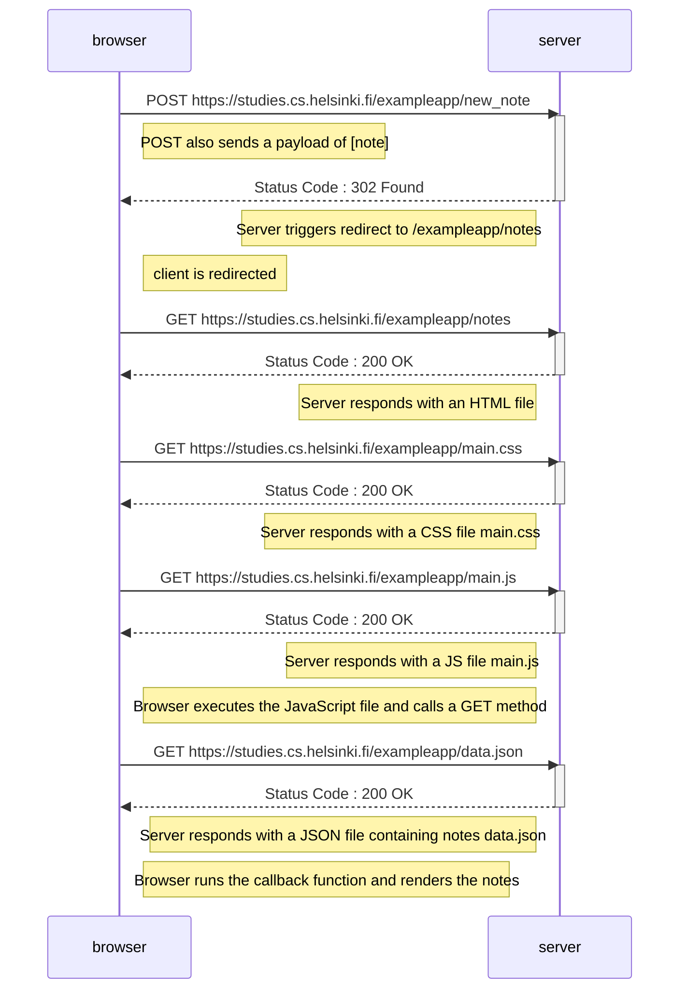

```mermaid
sequenceDiagram
    participant browser
    participant server

    browser->>server: POST https://studies.cs.helsinki.fi/exampleapp/new_note
    activate server
    Note right of browser: POST also sends a payload of [note]
    server-->>browser: Status Code : 302 Found
    deactivate server
    Note left of server: Server triggers redirect to /exampleapp/notes

    Note right of browser: client is redirected
    browser->>server: GET https://studies.cs.helsinki.fi/exampleapp/notes
    activate server
    server-->>browser: Status Code : 200 OK
    deactivate server
    Note left of server: Server responds with an HTML file

    browser->>server: GET https://studies.cs.helsinki.fi/exampleapp/main.css
    activate server
    server-->>browser: Status Code : 200 OK
    deactivate server
    Note left of server: Server responds with a CSS file main.css


    browser->>server: GET https://studies.cs.helsinki.fi/exampleapp/main.js
    activate server
    server-->>browser: Status Code : 200 OK
    deactivate server
    Note left of server : Server responds with a JS file main.js

    Note right of browser: Browser executes the JavaScript file and calls a GET method

    browser->>server: GET https://studies.cs.helsinki.fi/exampleapp/data.json
    activate server
    server-->>browser: Status Code : 200 OK
    deactivate server
    Note left of server : Server responds with a JSON file containing notes data.json

    Note right of browser: Browser runs the callback function and renders the notes
```