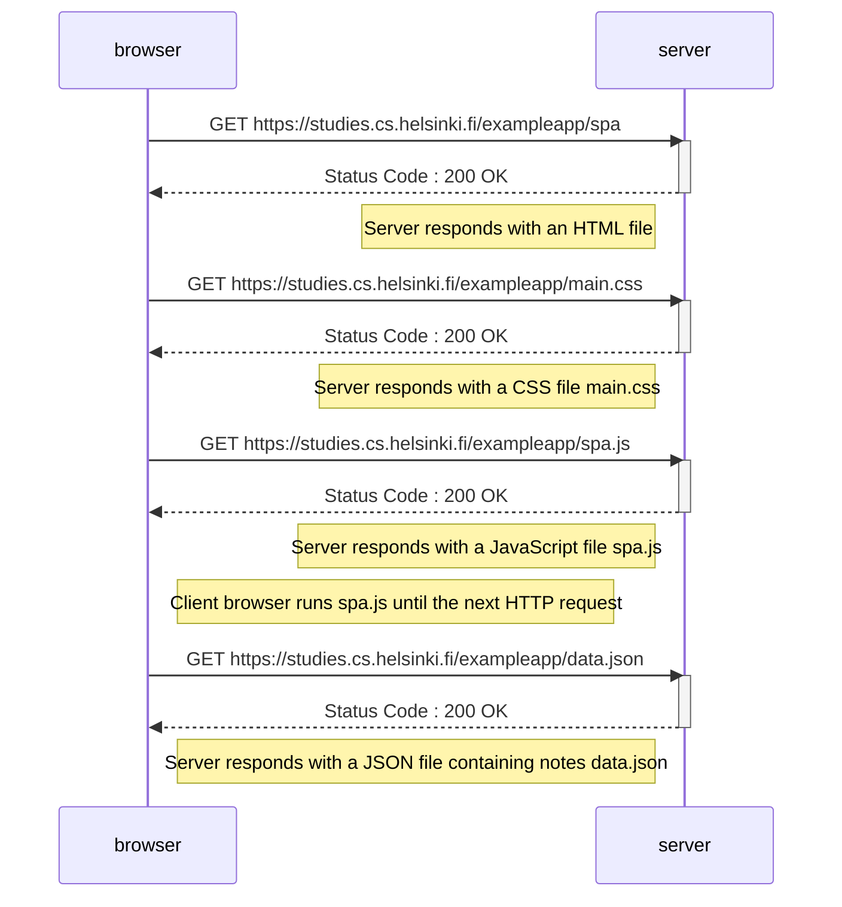

```mermaid
sequenceDiagram
    participant browser
    participant server

    browser->>server : GET https://studies.cs.helsinki.fi/exampleapp/spa
    activate server
    server-->>browser: Status Code : 200 OK
    deactivate server
    Note left of server: Server responds with an HTML file

    browser->>server: GET https://studies.cs.helsinki.fi/exampleapp/main.css
    activate server
    server-->>browser: Status Code : 200 OK
    deactivate server
    Note left of server: Server responds with a CSS file main.css

    browser->>server: GET https://studies.cs.helsinki.fi/exampleapp/spa.js
    activate server
    server-->>browser: Status Code : 200 OK
    deactivate server
    Note left of server : Server responds with a JavaScript file spa.js
    Note right of browser: Client browser runs spa.js until the next HTTP request

    browser->>server: GET https://studies.cs.helsinki.fi/exampleapp/data.json
    activate server
    server-->>browser: Status Code : 200 OK
    deactivate server
    Note left of server: Server responds with a JSON file containing notes data.json

```